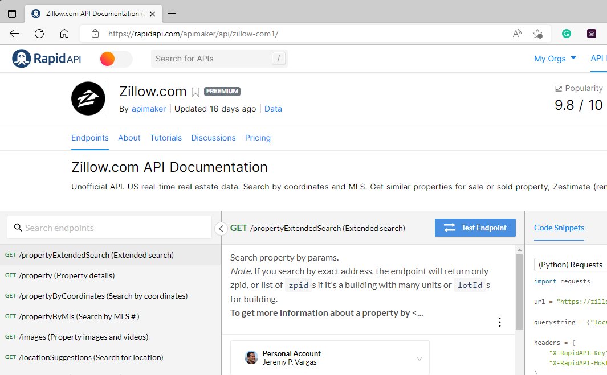
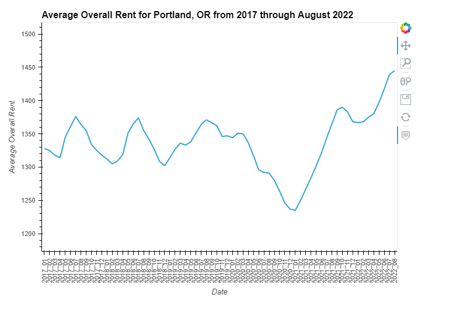
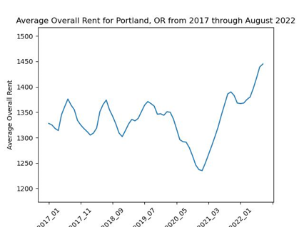
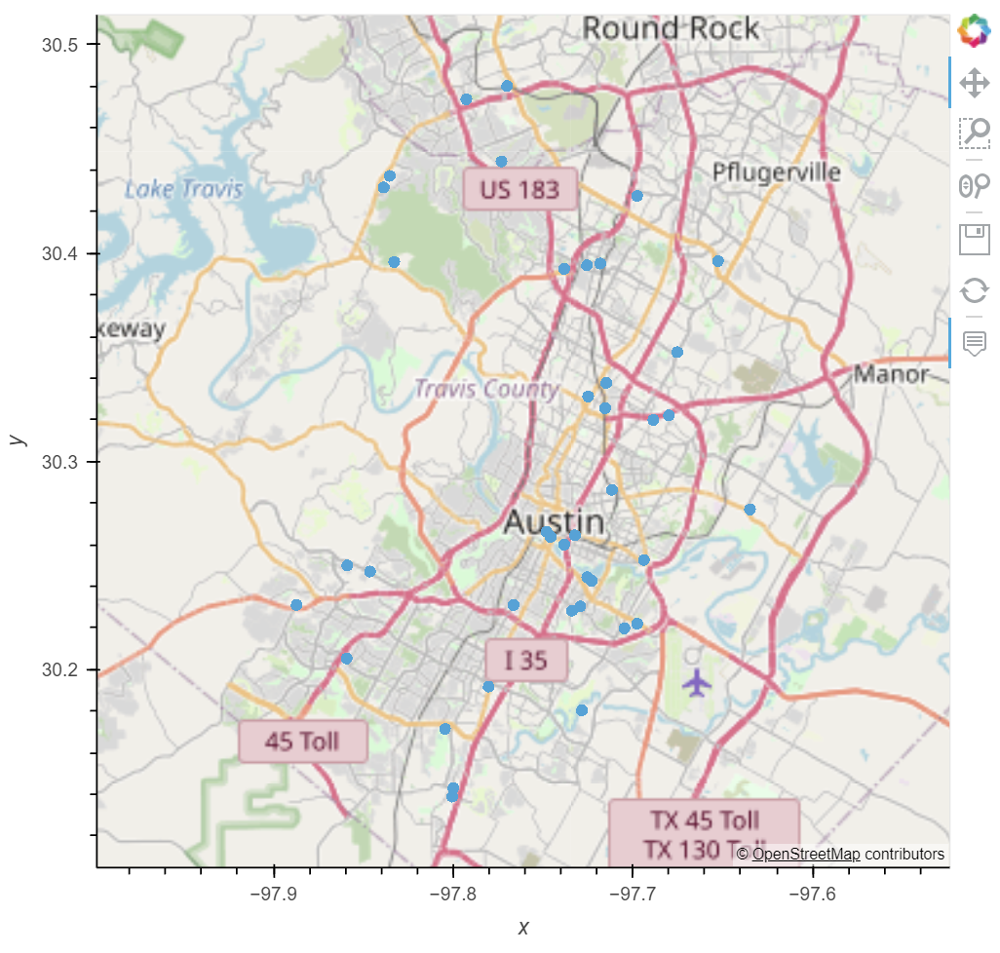

# Post-Pandemic Housing Relocator Tool

<!-- TABLE OF CONTENTS -->

  
Table of Contents

  <ol>
    <li>
      <a href="#purpose">Purpose</a>
      <ul>
        <li><a href="#inputs">Inputs</a></li>
        <li><a href="#outputs">Outputs</a></li>
      </ul>
    </li>
    <li>
      <a href="#technologies">Technologies</a>
      <ul>
        <li><a href="#zillow.com">zillow.com</a></li>
        <li><a href="#rapidapi.com">Rapid Api</a></li>
        <li><a href="#craigslist.com">craigslist</a></li>
        <li><a href="#apartsmentlist.com">Apartmentlistb</a></li>
        <li><a href="#time">time</a></li>
        <li><a href="hvplot">hvplot</a></li>
        <li><a href="#holoviews">holoviews</a></li>
        <li><a href="#fire">Fire</a></li>
        <li><a href="#questionary">questionary</a></li>
        <li><a href="#Pandas">Pandas</a></li>
        <li><a href="#matplotlib">Matplotlib</a></li>
      </ul>
    </li>
    <li><a href="#version-release">Version Release</a></li>
    <li><a href="#how_to_run">How to run</a></li>
    <li><a href="#usage">Usage</a></li>
    <li><a href="#contributors">Contributors</a></li>
    <li><a href="#license">License</a></li>
        <ul>
        <li><a href="#permissions">Permissions</a></li>
        <li><a href="#disclaimer">Disclaimer</a></li>
        </ul>
    </li>
    <li><a href="#aknowledgements">Aknowledgements</a></li>

<!--Purpose -->
## Purpose
This tool runs on Terminal/Gitbash. It is designed to pull the latest apartment rental information from Zillow.com using a "Rapid-API" provided by a 3rd party API developer. 
Subscription to service is required to pull real time data. 
The application analyzes data obtained via the API call and it is 
presented to the user along with rental prices as trended before the Pandemic.
This application can be used to provide decision support as the user selects to move to any of the cities available in the application.

### Inputs
    The application pulls availabe apartments for rent from zillow.com for 20 of the major US cities.
    Data is analyzed and presented to the user along with comparative rental price data from 
    analyzes housing price data from one file. Data is used to conduct futher analysis using Gross Rent, and the Price per square foot accross the neighborhoods of San Francisco.

    - Market Rental Data from Zillow.com - called by Rapid API
    - Apartment list.com ( rent estimate data for comparison)
    - User selects 1 city from 20 available through an interactive CLI
    
  
### Outputs
    City rental pricing report:
    - CSV file of city selected
    
    Visualizations:
    - Geolocation of appartments in city selected
    - Comparative interactive plot of rental price in city selected
    
---
<!--Technologies -->
## Technologies
### Python:

    Phyton Version: **3.7.13**

## Libraries and Dependencies

### zillow.com
[zillow](https://www.zillow.com/)

### rapidapi.com
[rapidapi](https://rapidapi.com/apimaker/api/zillow-com1/)

### craigslist.com
[craigslist](https://www.craigslist.org/about/sites)

### apartmentlist.com
[apartmentlist](https://www.apartmentlist.com/)

### time
[time](https://pandas.pydata.org/pandas-docs/stable/user_guide/timeseries.html)

### hvplot
[hvplot](https://pypi.org/project/hvplot/)

### holoviews
[holoviews](https://hvplot.holoviz.org/)

### fire
[fire](https://pypi.org/project/hvplot/)

### questionary
[questionary](https://pypi.org/project/questionary/)

### Pandas
[Pandas](https://pandas.pydata.org/pandas-docs/stable/reference/api/pandas.DataFrame.html) 

### Matplotlib
[Matplotlib](https://matplotlib.org/stable/api/_as_gen/matplotlib.pyplot.plot.html)

---
<!--How to run -->
## How to run

1. REQUIRED: RAPID-API from rapidapi.com free subscription for the first 20 runs. For DEMO, all data is provided.
2. Clone or download application and dependencies from GitHub
3. Run application on Terminal or GitHub.
4. Interact with application.
5. Save results and report as CSV

---
<!--Version Release -->
## Version Release

### Version 1.0

---
<!--Usage -->
## Usage

### Interactive Visualization of Average Rental Data - sample:

### Visualization of Average Rental Data saved for user - sample:

### Visualization of rentals available in map- sample:

---
<!--Contributors -->
## Contributors
Saidee Padilla

Cuong Ha

Jeremy Vargas

Thanks to:   
UW FinTech Bootcamp instructors and tutors

---
<!--License -->
## License
Portfolio Risk Analysis tool is available under an MIT License.

### Permissions
Permission is hereby granted, free of charge, to any person obtaining a copy of this software and associated documentation files (the “Software”), to deal in the Software without restriction, including without limitation the rights to use, copy, modify, merge, publish, distribute, sublicense, and/or sell copies of the Software, and to permit persons to whom the Software is furnished to do so, subject to the following conditions:

The above copyright notice and this permission notice shall be included in all copies or substantial portions of the Software.
### Disclaimer
The Software is provided “as is”, without warranty of any kind, express or implied, including but not limited to the warranties of merchantability, fitness for a particular purpose and noninfringement. In no event shall the authors or copyright holders be liable for any claim, damages or other liability, whether in an action of contract, tort or otherwise, arising from, out of or in connection with the software or the use or other dealings in the Software.

---
<!--Aknowledgements -->
## Aknowledgements
* [Markdown Guide](https://www.markdownguide.org/basic-syntax/#reference-style-links)

<!-- MARKDOWN LINKS & IMAGES -->
<!-- https://www.markdownguide.org/basic-syntax/#reference-style-links -->

